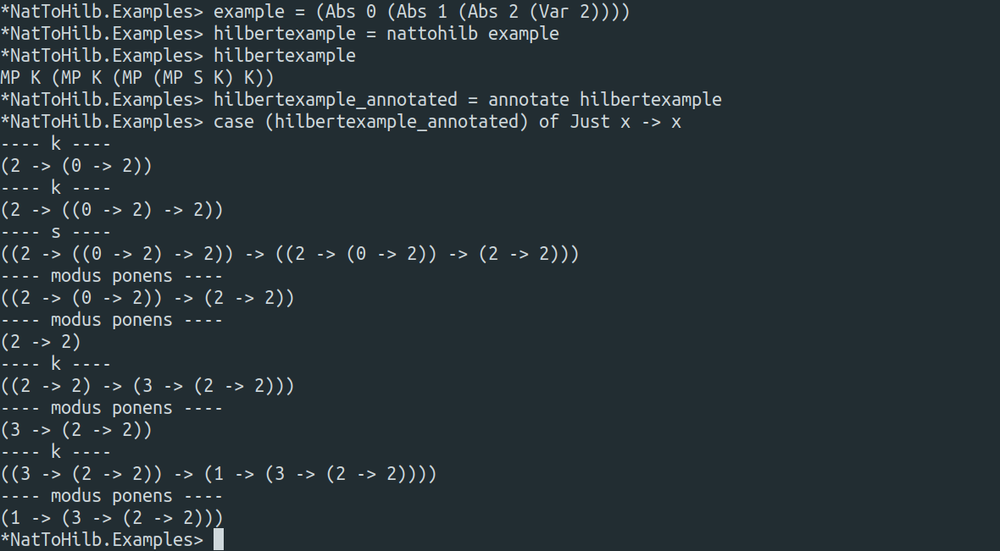

# A Natural Deduction to Hilbert System Proof Translator, with Type Inference

This is a translator from the natural deduction proof system to the hilbert proof system, and it concerns the intuitionistic propositional logic. It comes also with a type inference algorithm for proofs of tautologies in the hilbert system (that is, for closed proof terms), which given a proof term returns the most general form of the proposition it proves, if any. 

By the Curry-Howard Isomorphism, this is also a translator from the simply typed lambda calculus with sums, products and empty type to the SKI calculus with constructors and eliminators for sum, product and empty type.



## How to use

This project is separated in six modules

- `NatToHilb.NaturalDeduction` : defines syntax of untyped natural deduction proof terms and auxiliary functions
- `NatToHilb.HilbertSystem` : defines syntax of untyped hilbert system proof terms, a function `combabstraction` for the elimination of axioms (the algorithm of the deduction theorem) and other auxiliary functions
- `NatToHilb.NatToHilb` : defines the `nattohilb` translation function from natural deduction to the hilbert system
- `NatToHilb.Type` : defines the syntax for simple types (with also sums, products and empty type), a function `unify` that unifies a list of equations between types and other auxiliary functions
- `NatToHilb.TypedHilbert` : defines the syntax for typed hilbert system proof terms, a function `annotate` for type inference, a function `typecheck` for type checking and other auxiliary functions
- `NatToHilb.Examples` : examples of how to use the modules

The translation function `nattohilb` takes an untyped proof term in natural deduction and returns an untyped proof in the hilbert system. If you want to annotate this proof you can give it to the function `annotate`, which then returns its most general type (that is, the most general proposition that this term proves). As shown in the image, by printing the typed proof term we can see the proof tree (which is readable for small proofs).

## How it works

### Types

Simply types with products, sums and empty type are given by the following grammar. By the Curry-Howard correspondence, these represent the propositions.
```
Type ::= n (integer) | Type -> Type 
     | Type /\ Type | Type \/ Type | Bottom	    
```   	 

### Hilbert System

Concerning the hilbert system, we have a version with the following axioms (technically, axiom schemes). As usual, modus ponens is the only deduction rule.
```
S : (A -> B -> C) -> (A -> B) -> A -> C
K : A -> B -> A
Iand : A -> B -> A /\ B
ELand : A /\ B -> A
ERand : A /\ B -> B
ILor : A -> A \/ B
IRor : B -> A \/ B
Eor : A \/ B -> (A -> C) -> (B -> C) -> C
ExF : False -> A

Gamma |- M : A -> B       Gamma |- N : A
----------------------------------------- modus ponens
Gamma |- MP M N : B

------------------ Ax, with (Ax n : A) in Gamma
Gamma |- Ax n : A
```
This presentation is almost the same as the one in Section 5.1 of [1], with the only difference being the axiom `Iand`, which has type `(A -> B) -> (A -> C) -> A -> (B /\ C)` in [1]. It is not hard to see that both presentations are equivalent.

Regarding the rule Ax, it allows for the use of axioms of some context Gamma in the proof, allowing to write open proof terms. You are allowed to used them if you really want, but we do not implement contexts in this project, and the type inference algorithm will not work on them. However, if you have an open proof term you can always abstract the free variables using the algorithmic content of the Deduction Theorem, given by the function `combabstraction` (details are given later).


### Natural Deduction

For the natural deduction system, we have the following rules. The name of the rules explicit the Curry-Howard correspondence with the lambda calculus. Sequents are separated by a `&`. Variable names are integers.
```
-----------------------
Var n : B |- Var n : B

|- M : A -> B      |- N : A
----------------------------
|- App M N : B

Var n : B |- M : A
--------------------
|- Abs n M : B -> A

|- M : A      |- N : B
-----------------------
|- App M N : A /\ B

|- M : A /\ B
--------------
|- Pi1 M : A

|- M : A /\ B
------------------
|- Pi2 M : B

|- M : A
------------------
|- Inl M : A \/ B

|- M : B
------------------
|- Inr M : A \/ B

|- M : A \/ B      |- N : A -> C      |- P : B -> C
----------------------------------------------------
|- Case M N P : C

|- M : False
-----------------
|- Exfalso M : A
```

This presentation is almost the same one as given in Section 4.5 of [1] and of the propositional fragment of Section 8.1.4 of [3]. A small change here is that the rule that eliminates the `\/` (`Case` in this case) is normally given by the following.
```
|- M : A \/ B      n : A |- N : C      m : B |- P : C
------------------------------------------------------
|- Case M N P : C
```

It is easy to see that both presentations are equivalent, and the reason why we changed a bit this rule is to reduce the number of binders in rules to the minimal.

### Natural Deduction to Hilbert System Translation

The translation is given by the following algorithm.
```
nattohilb (Var x) = Ax x
nattohilb (App a b) = MP (nattohilb a) (nattohilb b)
nattohilb (Abs y a) = combabstraction y (nattohilb a)
nattohilb (Prod a b) = MP (MP Iand (nattohilb a)) (nattohilb b)
nattohilb (Pi1 a) = MP ELand (nattohilb a)
nattohilb (Pi2 a) = MP ERand (nattohilb a)
nattohilb (Inl a) = MP ILor (nattohilb a)
nattohilb (Inr a) = MP IRor (nattohilb a)
nattohilb (Case a b c) = MP (MP (MP Eor (nattohilb a)) (nattohilb b)) (nattohilb c)
nattohilb (Exfalso a) = MP ExF (nattohilb a)  
```
The function `combabstraction` is the algorithmic content of proof of the Deduction Theorem, which asserts that given a proof term `M` of type `A` and an axiom `Ax n` of type `B` (and which possibly appears in `M`), we can construct a proof term `M'` of type `B -> A` in which `Ax n` does not appear. In short, from `M` such that `Ax n : B |- M : A` we can construct `M'` such that `|- M' : B -> A` (see Lemma 5.4.11 of [1]).

Using `combabstraction n x`, which allows to abstract the variable `Ax n` from the term `x`, it is then easy to verify that `nattohilb` preserves typing, showing its correctness.

This translation also works for open terms, but as we do not implement any way to handle contexts, we recommend to stick to closed ones.

### Type inference of Hilbert System proof terms

As shown in Section 3.2 of [1], the problem of type inference can be reduced to the one of unification. In order to do so, we implement with function `unify` the Martelli/Montani algorithm for unification, given in [2].

We use this to implement the function `annotate`, which does the type inference. This allows one to reconstruct the proof tree of an untyped proof term, as shown in the image in the beginning. Moreover, we also implement a function `typecheck` that checks if a proof term is well typed (that is, if it is a valid proof).


As already mentioned, `annotate` will reject open terms, and if you have an open proof term you can always use `combabstraction` to abstract its free variables.

 
## References
[1] Morten Heine Sørensen and Pawel Urzyczyn. 2006. <i>Lectures on the Curry-Howard Isomorphism, Volume 149 (Studies in Logic and the Foundations of Mathematics)</i>.

[2] Alberto Martelli and Ugo Montanari. 1982. An Efficient Unification Algorithm.

[3] Dowek, G. Proofs in theories.


